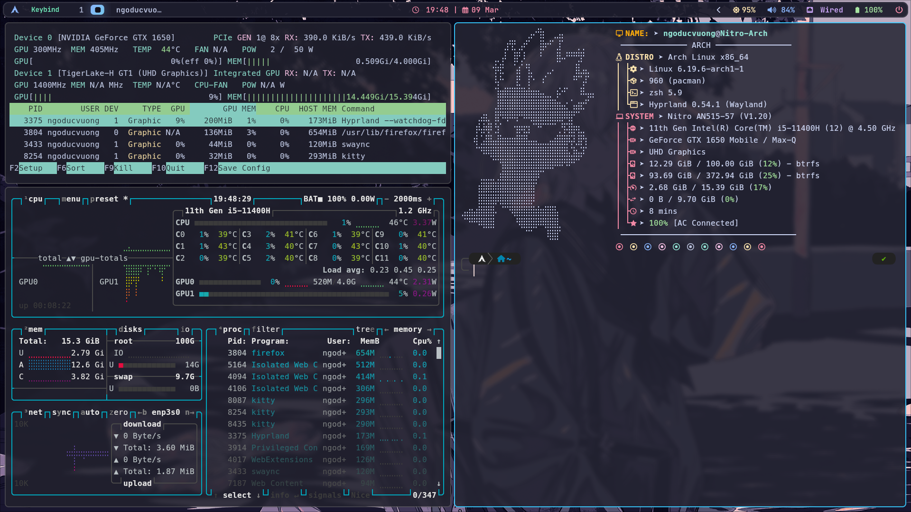

# <p align="center">🏔️ Arch-Config: The Ultimate Hyprland Experience</p>

<p align="center">
  <i align="center">Một bộ Dotfiles tinh tế, hiệu năng cao và hiện đại dành cho hệ sinh thái Arch Linux.</i>
</p>

<p align="center">
  
  
  
</p>

---

## 📸 Giao diện người dùng (Gallery)
<p align="center">
  
</p>

---

## 🏗️ Kiến trúc hệ thống (Core Stack)
Sự kết hợp hoàn hảo giữa tính ổn định của **GNOME Services** và sự mượt mà của **Wayland Compositor**.

* **Compositor:** `Hyprland` (Dynamic Tiling WM với hiệu ứng mượt mà)
* **Status Bar:** `Waybar` (Cấu hình tối giản, trực quan)
* **Shell:** `Zsh` + `Oh-My-Zsh` + `Powerlevel10k`
* **Terminal:** `Kitty` (Tăng tốc xử lý bằng GPU)
* **App Launcher:** `Rofi-Wayland`
* **Notification:** `SwayNC` (Trung tâm thông báo hiện đại)
* **Security:** `Polkit-GNOME` (Trình xác thực quyền root)
* **Input:** `Fcitx5-Bamboo` (Bộ gõ Tiếng Việt tiêu chuẩn)

---

## 📂 Cấu trúc Repository
```text
.
├── config/              # Các file cấu hình ứng dụng (.config)
│   ├── hypr/            # Hyprland rules, binds & monitors
│   ├── waybar/          # Giao diện thanh trạng thái
│   ├── kitty/           # Cấu hình Terminal
│   └── rofi/            # Giao diện menu ứng dụng
├── install/             # Các scripts cài đặt tự động theo module
├── fonts/               # Phông chữ hệ thống & Icon fonts
└── README.md            # Tài liệu hướng dẫn này
```
## 🚀 Quy trình cài đặt (Installation)
``` bash
git clone https://github.com/ngovuong-dev/Arch-Config.git
cd Arch-Config
chmod +x install/*.sh
```
## ⌨️ Phím tắt mặc định (Keybindings)

Tổ hợp phím,Hành động
***SUPER + Return**,Mở Terminal (Kitty)
***SUPER + Q**,Đóng cửa sổ hiện tại (Kill)
***SUPER + E**,Quản lý tệp tin (Thunar/Nautilus)
***SUPER + A**,Tìm kiếm và khởi chạy ứng dụng
***SUPER + W**,Chuyển đổi trạng thái cửa sổ nổi (Floating)
***SUPER + O/P**,Chuyển đổi tiêu điểm giữa các cửa sổ
***SUPER + Shift + Alt + Del**,Thoát phiên làm việc (Logout)

## 🌡️ Lưu ý cho Laptop (Performance & Thermal)
```bash
# Để tối ưu nhiệt độ và pin
powerprofilesctl set power-saver

# Để đạt hiệu năng tối đa
powerprofilesctl set performance
```

Ngày cập nhật: 09/03/2026
